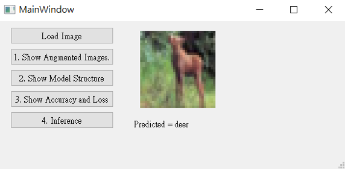
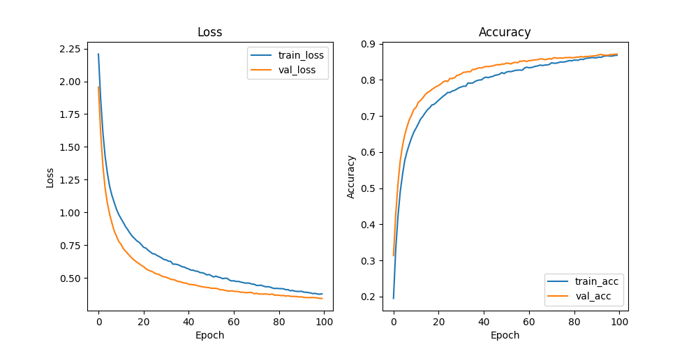
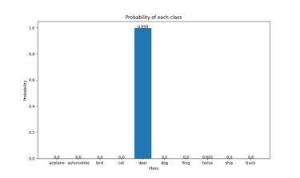
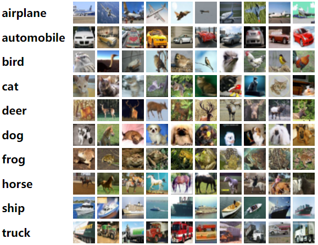

# CIFAR10
Training a CIFAR10 Classifier Using VGG19 with BN

📌 Overview

This project trains a VGG19-based deep learning model with Batch Normalization (BN) on the CIFAR-10 dataset. The model is designed to classify 10 different object categories, making it a great benchmark for image classification tasks, with an GUI.

-----------------------------------------------------------------------------------------------------------------------------------------------------------

⚡ Features

✅ VGG19 architecture with Batch Normalization for improved convergence

✅ Data augmentation to enhance model generalization

✅ Model training, validation, and inference pipeline

✅ Evaluation metrics including accuracy, loss curves, and confusion matrix

✅ Support for GPU acceleration using PyTorch/TensorFlow

✅ GUI Included

-----------------------------------------------------------------------------------------------------------------------------------------------------------

📂 Project Structure
```
CIFAR10/
│── data/                 # Dataset (automatically downloaded)
│── models/               # Saved trained models
│── output/               # Training results (accuracy, loss plots)
│── src/                  # Source code
│   ├── main.py           # Main script to train and test the model
│   ├── cifar10_train.py  # Handles dataset loading, augmentation, training
│── requirements.txt      # Dependencies list
│── README.md             # Project documentation
│── LICENSE               # MIT License
```

-----------------------------------------------------------------------------------------------------------------------------------------------------------

📦 Installation & Setup

🔹 Step 1: Clone the Repository

```bash
git clone https://github.com/EugenePau/CIFAR10.git
cd CIFAR10
```

🔹 Step 2: Create a Virtual Environment (Optional but Recommended)

```bash
python -m venv venv
source venv/bin/activate   # On macOS/Linux
venv\Scripts\activate      # On Windows
```

🔹 Step 3: Install Dependencies

```bash
pip install -r requirements.txt
```
-----------------------------------------------------------------------------------------------------------------------------------------------------------

🚀 Training the Model

Run the following command to train the VGG19 model on CIFAR-10:

```bash
python main.py --epochs 50 --batch_size 128 --learning_rate 0.001
(Modify epochs, batch_size, and learning_rate as needed.)
```


🚀 GUI for Simple Navigation



-----------------------------------------------------------------------------------------------------------------------------------------------------------

📈 Model Performance & Evaluation

✅ Training & Validation Accuracy Curves

After training, accuracy and loss curves will be automatically saved in the output/ folder.




✅ Sample Predictions on Test Images

Below is an example of the model's predictions on CIFAR-10 test images:




-----------------------------------------------------------------------------------------------------------------------------------------------------------

📊 CIFAR-10 Dataset

The CIFAR-10 dataset consists of 60,000 images (32x32 pixels) across 10 classes:

Label	Class Name

0	Airplane ✈️

1	Automobile 🚗

2	Bird 🐦

3	Cat 🐱

4	Deer 🦌

5	Dog 🐶

6	Frog 🐸

7	Horse 🐴

8	Ship 🚢

9	Truck 🚚



-----------------------------------------------------------------------------------------------------------------------------------------------------------

🤝 Contributing
Want to improve this project? Feel free to fork the repo and submit a pull request!

Fork the repository
Create a feature branch (git checkout -b feature-branch-name)
Commit changes (git commit -m "Added new feature")
Push to GitHub (git push origin feature-branch-name)
Create a Pull Request
